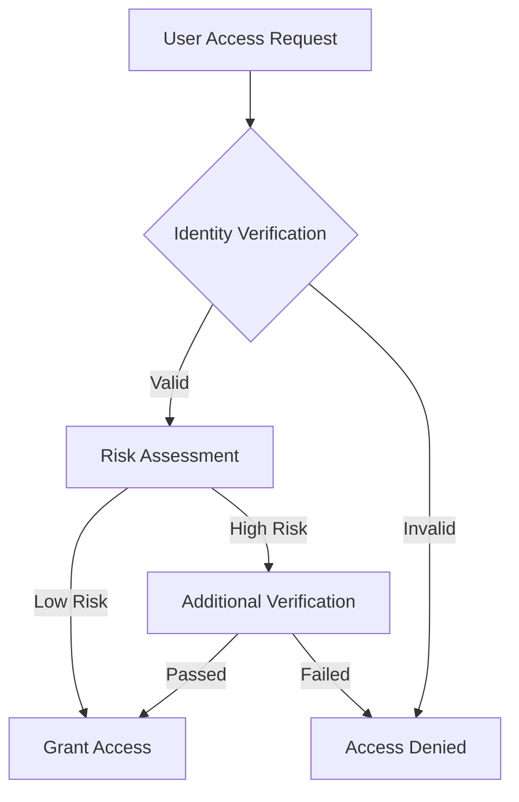
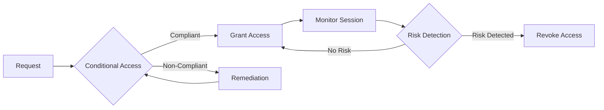

# Zero Trust Architecture Documentation

## Overview
This document describes the implementation of Zero Trust security principles in Microsoft 365 and Entra ID environments.

## Core Components

### 1. Identity Protection
- Multi-factor Authentication (MFA)
- Conditional Access Policies
- Identity Risk Detection
- Privileged Identity Management

### 2. Access Control
- Just-In-Time Access
- Privileged Access Workstations
- Session Management
- Access Reviews

### 3. Security Monitoring
- Real-time Threat Detection
- Behavioral Analytics
- Audit Logging
- Alert Management

## Implementation Details

### Identity Protection

### Access Control Flow
